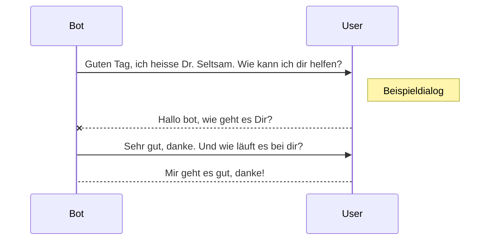

# chatbot
Projektarbeit Python 2025-I

Ziele: möglichst viele bisher behandelte Aspekte von Python wiederholen

- Klassen definieren und Objekte nutzen
- RegEx (reguläre Ausdrücke ) - Erkennen von Mustern in der Grammatik

- Verzicht auf alle, die nicht zur Python Standard Library gehören

## Appendix

## Beispiel-Dialog

