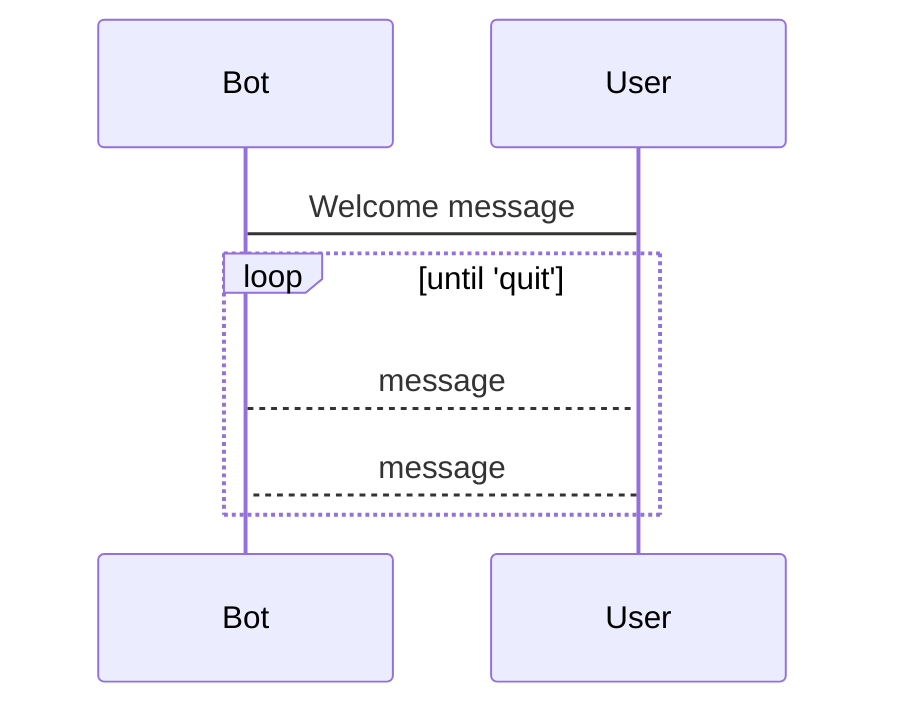
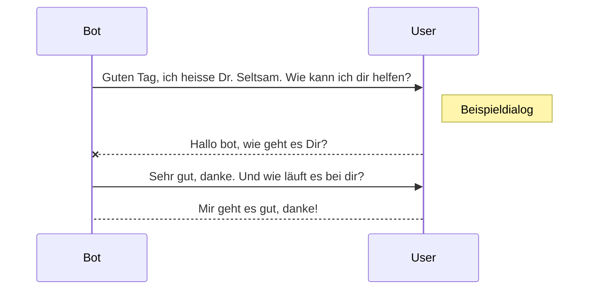

# Mustererkennung / Reguläre Ausdrücke
Projektarbeit Python 2025-I
Diese Dokumentation ist (auf Gruppenwunsch) in Deutscher Sprache verfasst

## Ziele: 

Möglichst viele bisher behandelte Aspekte von Python wiederholen

- Klassen definieren und Objekte nutzen
- RegEx (reguläre Ausdrücke ) - Erkennen von Mustern in Texten (zunächst nur deutsch)
- Verzicht auf alle Erweiterungen, die nicht zur <b>Python Standard Library</b> gehören

## Programmablauf

## Benutzung 

### Unix/Mac/Linux/Solaris ...
<pre>
<code>
foo@ASGARD chatbot % python3 chat_bot.py
Guten Tag, ich heisse ChatBot 2025.  Wie ist dein Name?
User:
</code>
</pre>

## Beispiel-Dialog

## Zukünftige Erweiterungen

- Pflege der Regexe / Antworten unabhängig in "Laiensprache" in externer Datei
- Anbindung von Online-Services etc. (z.B: Google, Wiktionary, Wikidata usw.)
- Archiv: speichern von Dialogen, Lesen vorheriger Verläufe ..
